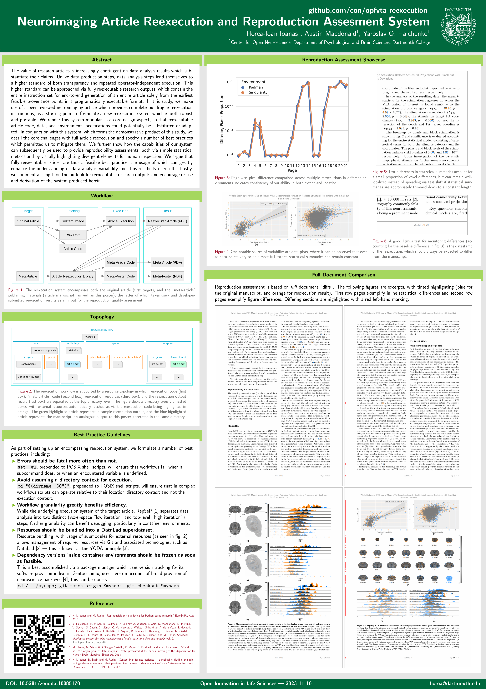
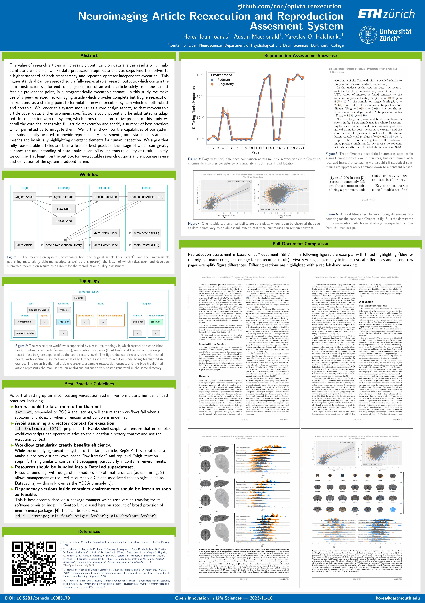

# Beamerposter Themes

This repository contains `.sty` themes for the beamerposter class allowing for the rapid creation of LaTeX posters using to the visual identity guidelines of various universities.

## Usage

To produce the documents, you simply need to run `make poster-<UNI>` where `<UNI>` is the name of the university, as seen among the available `.tex` files.
For example:

```console
make poster-Dartmouth
```

will create a poster with a Dartmouth theme.

```console
make poster-ZH
```

will create a poster using the common color scheme and integrating the logos of the University of Zurich and ETH Zurich.

Cleaning traces (regardless of the previously compiled target) is accomplished by running `make clean`.

For usage on custom projects, the `poster-<UNI>.tex` file can be modified to fit the desired presentation content.

## Examples




